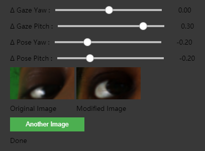
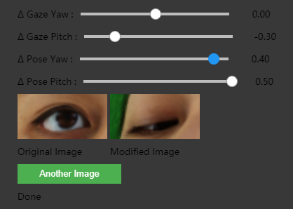
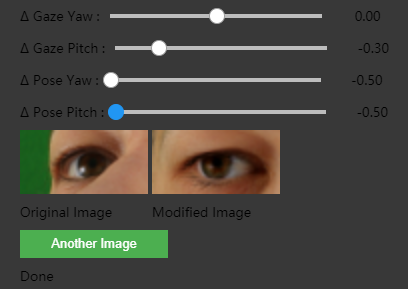

# GazeFlow Demo
This is a simple demo of *GazeFlow: Gaze Redirection with Normalizing Flows.*

Colab:  [GazeFlowDemo](https://colab.research.google.com/drive/1TALhnvy6CuyzpC29mS8CShZH3mpV8AAG?usp=sharing)

The offical implementation of GazeFlow will be available on: https://github.com/CVI-SZU/GazeFlow

## Introduction

In this demo, you can drag the slide bar and you will see the modified eye image.

Just like this:

## Reference

[MokkeMeguru/TFGENZOO](https://github.com/MokkeMeguru/TFGENZOO)
